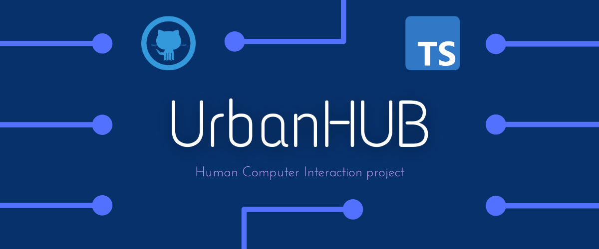
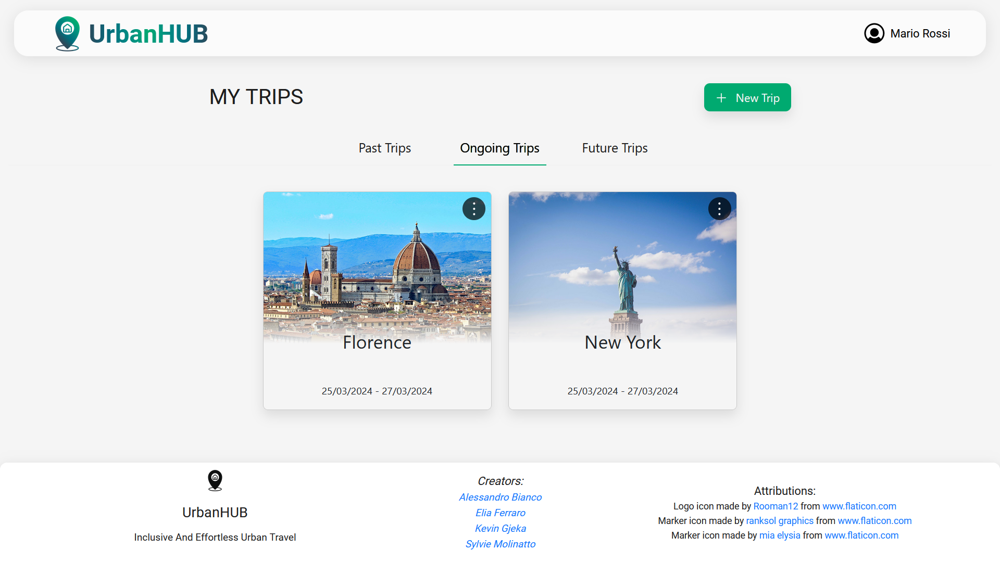
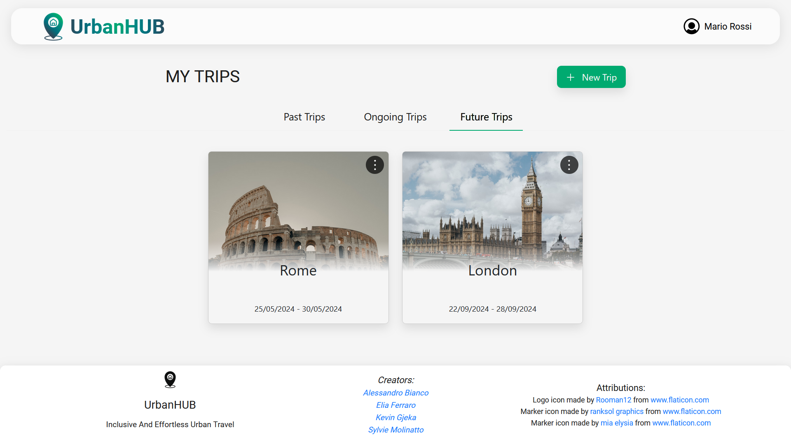
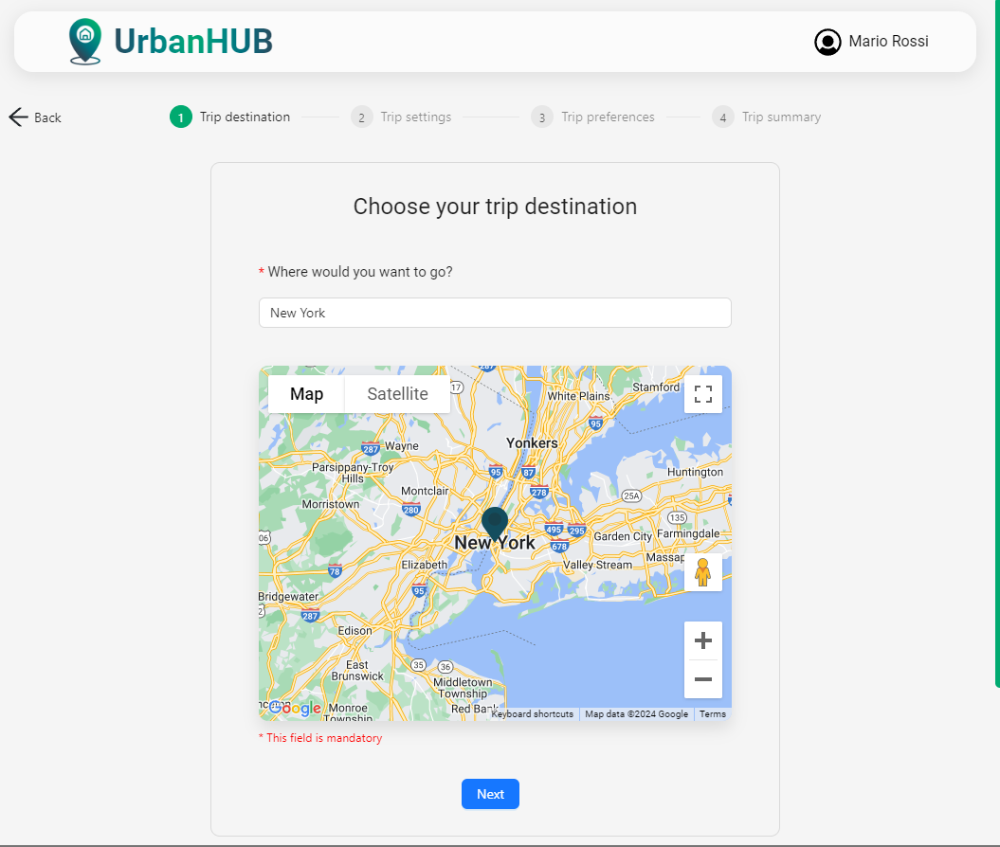
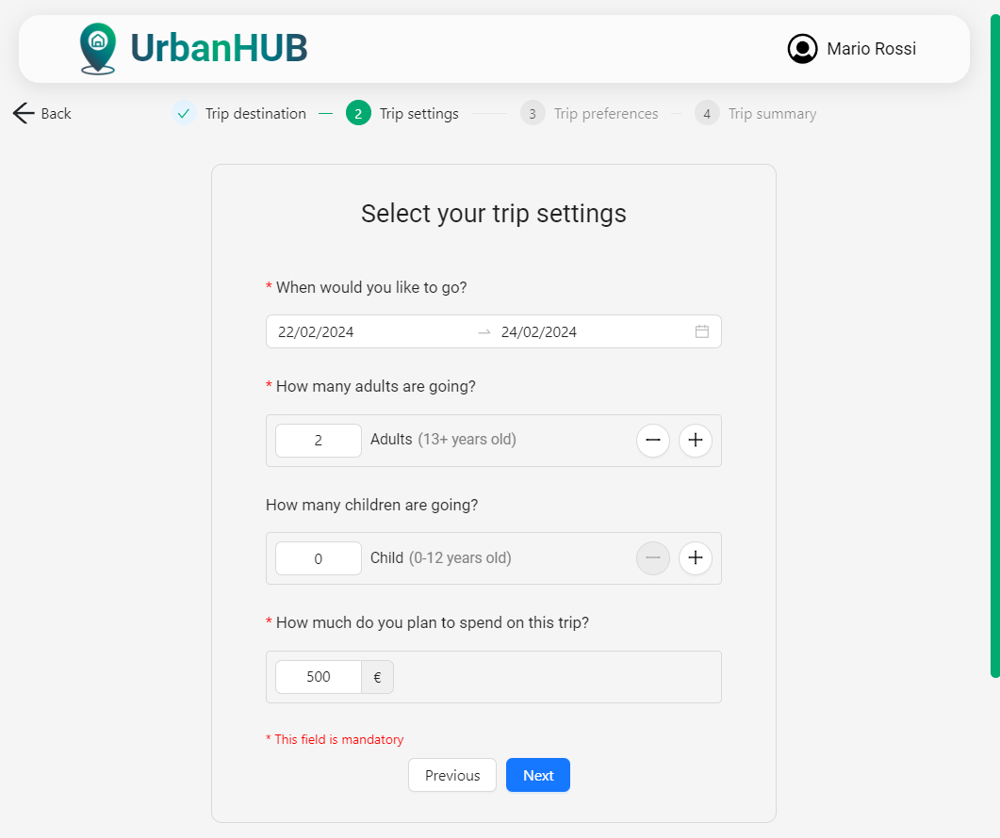
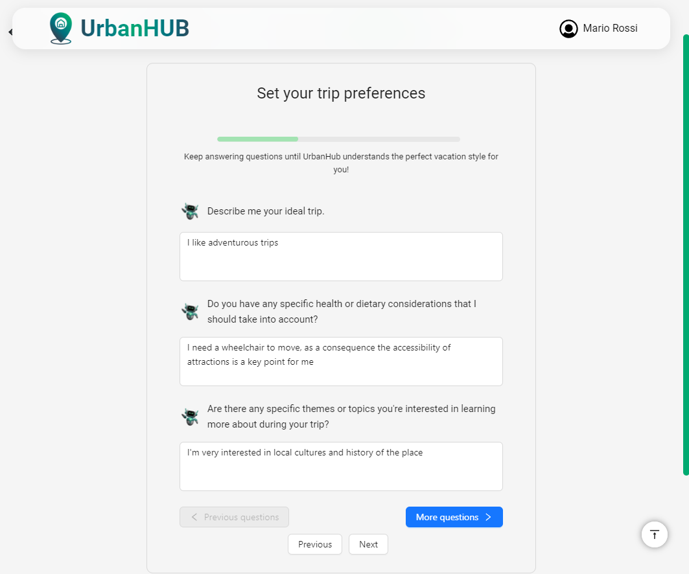
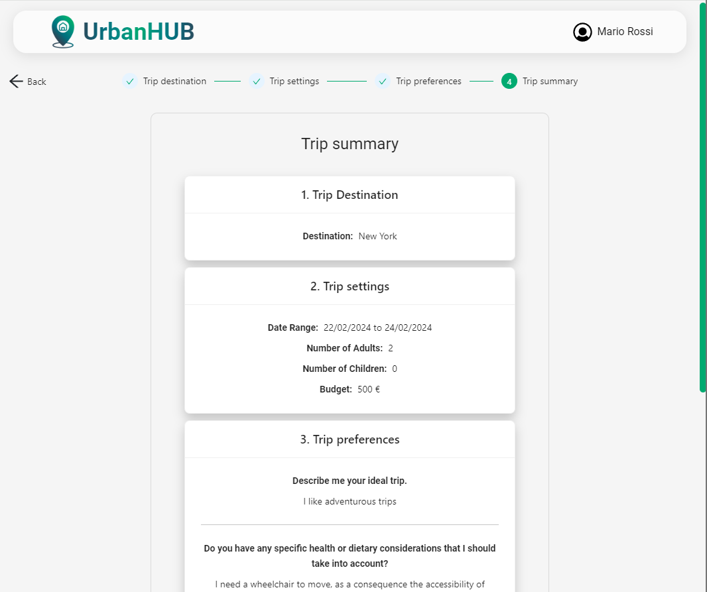
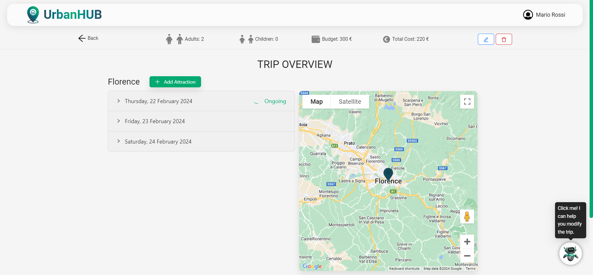
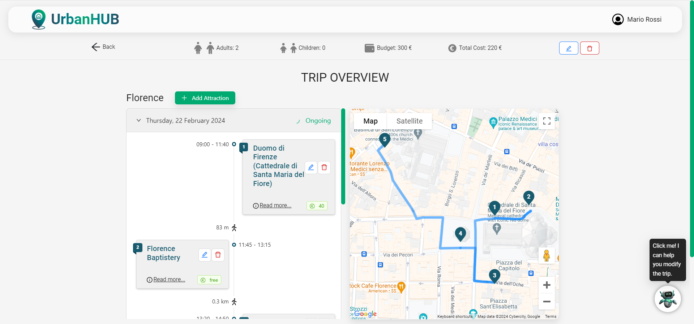

<html>
  

    

      
    

    

      
      
    

    

    <h1>UrbanHUB</h1>
    

    

      <a href="#overview">Overview</a>
      </li> | <a href="#how-to-run">How to run the project</a>
      </li> | <a href="#credentials">Credentials</a>
      </li> | <a href="#frontend-documentation">Frontend Documentation</a>
      </li> | <a href="#backend-documentation">Backend Documentation</a>
      </li> | <a href="#database-documentation">Database Documentation</a>
      </li> | <a href="#contributors">Contributors</a>
    

    

      
      
      
      
      
    

  

  

    <h2>Overview</h2>
    
 UrbanHUB is a high-fidelity web application prototype aimed at optimizing the trip planning process using AI assistance. It offers users personalized route suggestions, attraction recommendations, and transportation options. While the AI implementation is simulated, the prototype demonstrates how AI can seamlessly integrate into the user experience, enhancing efficiency and satisfaction in creating customized itineraries. 

    

      
      
    

    

      
      
    

    

      
      
    

    

      
      
    

  

  

    <h2>How to run the Project</h2>
    
Execute the following commands in a Command Shell:

    

      <code>cd Urbanhub/urbanhub</code> - Enter the folder
    

    

      <code>npm install</code> - Install all the dependencies
    

    

      <code>npm start</code> - Start the application
    

    
⚠️ <em>If you don't have npm installed you can download it from here: <a href="https://docs.npmjs.com/downloading-and-installing-node-js-and-npm">npm</a>
      </em>
    

  

  
  

    <h2>Contributors</h2>
    

      </li>   <a href="https://github.com/alewhite11">Alessandro Bianco</a>
      </li> | <a href="https://github.com/EliaFerraro">Elia Ferraro</a>
      </li> | <a href="https://github.com/Sylvie-Molinatto">Sylvie Molinatto </a>
      </li> | <a href="https://github.com/lithekevin">Kevin Gjeka</a>
    

  

</html>